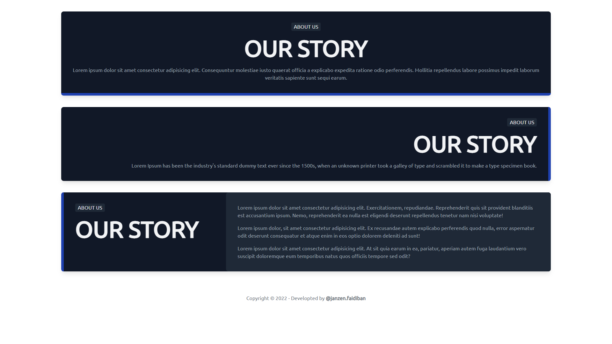

# Learn Tailwind CSS in Creating Web Page Sections

Tailwind CSS merupakan Utiity-First CSS Framework
Official website [https://tailwindcss.com](https://tailwindcss.com)

Dokumentasi bisa cek di [https://tailwindcss.com/docs/](https://tailwindcss.com/docs/)


## Installation

Cara mudah menginstal atau mengintegrasi tailwind yaitu menggunakan link CDN ```<script src="https://cdn.tailwindcss.com"></script>``` yang ditempatkan di atara tag ```<head>...</head>``` 

```html
<!doctype html>
<html>
<head>
    <meta charset="UTF-8">
    <meta name="viewport" content="width=device-width, initial-scale=1.0">
    <script src="https://cdn.tailwindcss.com"></script>
    </head>
<body>
    <h1 class="text-3xl font-bold underline">
    Hello world!
    </h1>
</body>
</html>
```

## Page Sections

Hero Sections <br>
Feature Sections <br>
CTA Sections <br>
Pricing Sections <br>
Header Sections <br>
FAQs Sections <br>
Newsletter Sections <br>
Stats Sections <br>
Testimonials Sections <br>
Blog Sections <br>
Contact Sections <br>
Team Sections <br>
Content Sections <br>
Footers Sections <br>
Logo Clouds <br>

## Elements
Header <br>
Banner <br>
Flyout Menus <br>

## Feedback
404 Pages <br>


## Header

Desain section header

